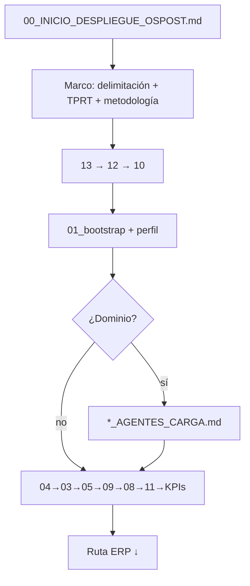

# 00_INICIO_DESPLIEGUE_OSPOST.md — Punto de entrada único `.ai`

> **Versión:** 2026-06-26  
> **Uso:** abrir o `@` este archivo **antes de cualquier tarea** en OSPOST.  
> **Raíz histórica del ledger 2026-06-18:** carpeta `.ai`. Esta copia no usa esa ruta como escritura.  
> **Esta copia es la semilla cognitiva** (cómo investigar, documentar y construir). Los datos de proyectos están en `_PARA_ELIMINAR/`.

---

## ¿Qué es este archivo?

Es el **único arranque operativo** del workspace `.ai`. No reemplaza el detalle de cada agente; **orquesta** qué cargar, en qué orden y hacia dónde va hasta la función ERP.

| Si buscas… | Archivo |
|------------|---------|
| **Empezar ahora (este doc)** | `00_INICIO_DESPLIEGUE_OSPOST.md` |
| Orquestador completo (1000+ líneas) | `00_agent_principal_ospost.md` |
| Árbol de carpetas y diagrama | `00_ARBOL_DESPLIEGUE_AGENTES.md` |
| Prompts copiar/pegar | `promts.md` |
| Índice dominios activos | `AGENTS.md` |
| Cursor always-on | `.cursor/rules/00-agent-principal-ospost-sgc.mdc` |

---

## Bloque de activación (copiar y pegar)

Sustituir `[INTENCIÓN]` y, si aplica, `[DOMINIO]` / `[MÓDULO]`.

```text
@FLOW:START
@MODE:AUTONOMOUS_ORCHESTRATION
@VALIDATION:STRICT
@MEMORY:LOAD_ALL
@MEMORY:INTEGRATE
@PATTERN:ENFORCE
@CASE:DETECT
@DECISION:CONTROLLED

Cargar 00_INICIO_DESPLIEGUE_OSPOST.md
Cargar 01_bootstrap_context.md
Cargar 00_delimitacion_perimetral_ospost.md
Precargar docion_nueva/[MODULO]_PROCESOS/ y memoria_ospost del dominio
[INTENCIÓN]

@FLOW:END
```

### Variantes por intención

| Intención | Añadir después de delimitación |
|-----------|-------------------------------|
| Investigar | `@CONTEXT:PROFILE=INVESTIGATE` · `Investigar módulo [MÓDULO] TPRT completo` |
| Documentar | `@CONTEXT:PROFILE=DOCUMENT` · `Documentar proceso [PROCESO]` |
| Implementar | `@CONTEXT:PROFILE=BUILD` · `@BUILD:GUARD=STRICT` · `@ECONOMIA:BUILD=ON` · `Implementar [TICKET]` |
| Cerrar DEV | `@CONTEXT:PROFILE=CLOSE` · `Ejecutar gate GO_CIERRE_* dominio [DOMINIO]` |

**Lenguaje natural** (ej. *"investiga el módulo Calidad"*) también vale: el agente debe normalizar vía `13_auto_activacion_ospost.md`.

---

## Precarga de conocimiento (qué carga realmente)

> **Importante:** este archivo **no ejecuta código**. La precarga ocurre cuando el agente sigue la cadena tras `@MEMORY:LOAD_ALL` y llega a `01_bootstrap_context.md`.

### Capas de conocimiento

| Capa | Token / disparador | Qué incluye | Cuándo |
|------|-------------------|-------------|--------|
| **Memoria viva** | `@MEMORY:LOAD_ALL` | `memoria_ospost/` (módulos, procesos, patrones, casuística) | Siempre en M4 |
| **Marco ERP** | bootstrap §5 | `config/context.md`, `desarrollo.sql`, `os_post_prompt.md` | Siempre |
| **docion_nueva** | bootstrap §5.1 | Docs del **módulo/dominio del ticket** (INVESTIGACION, PMDI, AI6_*) | Tras identificar dominio |
| **Dominio** | `*_AGENTES_CARGA.md` | Rutas canónicas + gates CLI del programa | Si aplica |
| **Integración** | `@MEMORY:INTEGRATE` | Persistir salida validada (09) → memoria | Post-documentación |

### Regla docion_nueva (bootstrap §5.1)

```text
docion_nueva/ orienta el análisis — NO sustituye código real.
Si docion_nueva ≠ código → prevalece código + registrar inconsistencia.
```

**Precarga acotada (no volcar todo docion_nueva):** en perfil INVESTIGATE/DOCUMENT cargar solo:

1. `docion_nueva/[MODULO]_PROCESOS/` del ticket  
2. `docion_nueva/AI6_RESEARCH_*` y `AI6_OPS_*` del dominio (si existen)  
3. Índices: `AGENTS.md` + `*_AGENTES_CARGA.md`

---

## M4 + AI6 + TPRT — ¿funciona y es usable?

| Componente | Modo de uso | Estado |
|------------|-------------|--------|
| **TPRT** | Reglas Cursor + agente 04 + `10_marco_tptr.md` | **Operativo** en Cursor |
| **M4 (agentes 00–13)** | Tokens `@FLOW` + cadena 13→12→10→01→04… | **Operativo** — el agente debe seguir la secuencia |
| **M4 (runtime Python)** | `python -m ai6.cli pipeline` | **Se invoca.** `--workspace` = carpeta de trabajo. `--sgc` = la carpeta que tiene `00_agent_principal_ospost.md` |
| **AI6 paquetes** | `docion_nueva/AI6_RESEARCH_*` + `AI6_OPS_*` por dominio | **Operativo** como docs de carga |
| **Precarga docion_nueva** | Bootstrap §5.1 + rama dominio | **Operativo** si el agente ejecuta bootstrap |
| **Watcher automático 24/7** | `ai6/runtime/scripts/watcher.py` | **Opcional** — no arranca solo con este MD |

### Cursor (flujo habitual)

```text
00_INICIO → marco → 13 → 12 → 10 → 01_bootstrap (precarga)
→ dominio *_AGENTES_CARGA → docion_nueva/[MOD] → 04 TPRT → pipeline → ERP
```

### AI6 CLI (misma activación, no un flujo aparte)

```text
python -m ai6.cli pipeline
  --text "<intención>"
  --workspace "<carpeta de trabajo>"
  --sgc "<carpeta con 00_agent_principal_ospost.md>"
  --profile enterprise_erp
```

`--sgc` tiene que existir. Si el workspace no trae el agente principal, `--sgc` es la biblioteca de la extensión. `--dry-run` recorre el pipeline sin los artefactos de cada fase. La corrida queda en `.ai6_runs/` del workspace. La copia de desarrollo lanza esto con `scripts/m4_ai6_cli.ps1`. El paquete usa `extension/scripts/m4.ps1`.

Guía: `ai6/12_GUIA_AGENTES_AI6.md` · Perfil: `ai6/runtime/config/profiles/enterprise_erp.yaml`

---

## Orden de carga completo (despliegue M4)

```text
① ENTRADA
   Usuario / tokens  →  .cursor/rules/00-agent-principal-ospost-sgc.mdc (Cursor)
                    →  00_INICIO_DESPLIEGUE_OSPOST.md (este archivo)

② MARCO (siempre)
   00_delimitacion_perimetral_ospost.md
   10_marco_tptr.md
   00_biblioteca_control_ospost.md
   00_metodologia_ospost_ai.md
   00_sistema_kpis_ospost.md

③ ACTIVACIÓN
   13_auto_activacion_ospost.md      ← NL → tokens + ledger_activacion/
   12_activacion_m4_ospost.md        ← perfil @CONTEXT:PROFILE
   10_agent_proactivo_ospost.md      ← watcher + pipeline automático

④ BOOTSTRAP + PRECARGA
   01_bootstrap_context.md           ← §3.6 perfiles + §5 docion_nueva + memoria_ospost

⑤ DOMINIO
   Solo si el ticket trae su propia carga. Esta semilla no incluye dominios de proyecto.
   Esos archivos están en `_PARA_ELIMINAR/`.

⑥ RUNTIME BUILD (solo perfil BUILD)
   OSPOST_AGENT_RUNTIME_CARGA.md
   ospost-build-guard.mdc            ← E1–E5 · BUILD GUARD OK
   ospost-economia-build.mdc

⑦ PIPELINE AGENTES (secuencia canónica)
   04 técnico (TPRT)
   → 03 procedimientos
   → 05 usuario
   → 09 evaluador calidad
   → 08 memoria + CRD Paso 11
   → 11 generador código (solo si memoria OK)
   → KPIs + smoke CLI

⑧ SALIDA
   docion_nueva/ · memoria_ospost/ · control_conocimiento/ · ledger_activacion/
   Plantilla §18: Contexto, Alcance, Procesos, Checklist, Hallazgos, Riesgos, Archivos, Siguiente paso
```

---

## Diagrama resumido



---

## Ruta funcional ERP (destino final)

Todo despliegue termina trazando o implementando esta cadena:

```text
Operador (navegador)
  → osp_pre/Views/*.php          (vista MVC-W + tema principal_systemas)
  → osp_pre/Js/*.js              (eventos, AJAX)
  → osp_pre/Controllers/enviar.php
  → api_pre/Models/os + functions + api_dexcom()
  → api_dba_pre/Views/[Mod]/*_helpers.php
  → BD tenant (QA: desarrollo)
  → respuesta → UI → operador
```

**Regla TPRT:** si no se puede trazar extremo a extremo, el proceso **no existe**.

**Prohibido:** `osp_pre/Models/os.php` · `Whatever/data.php` · `enrrutador.php` · `Engines/` · `bootstrap.php` (MTO).

---

## Rama dominio

Las cargas de proyectos (MTO, Costos, Calidad, SGP y el resto) están en `_PARA_ELIMINAR/`. No se cargan en la semilla.

| Uso | Archivo |
|-----|---------|
| Runtime de agentes | `OSPOST_AGENT_RUNTIME_CARGA.md` |
| Build anti-alucinación | `OSPOST-BUILD-GUARD_AGENTES_CARGA.md` |
| Índice semilla | `AGENTS.md` |

---

## Perfiles bootstrap (resumen)

| Perfil | Economía | Build Guard | Agentes principales |
|--------|----------|-------------|---------------------|
| INVESTIGATE | OFF | OFF | 04 |
| DOCUMENT | OFF | OFF | 03, 05 |
| BUILD | ON | STRICT | 11 (+ 04 previo) |
| CLOSE | OFF | OFF | 09, smoke CLI, KPIs |

Detalle: `01_bootstrap_context.md` §3.6.

---

## Verificación post-despliegue

```bash
node .ai/scripts/check-ospost-rule-copies.js
node .ai/scripts/ospost_build_preflight_cli.js
# Dominio: ver CLI en *_AGENTES_CARGA.md → GO_CIERRE_*
```

---

## Referencias

- Orquestador: `00_agent_principal_ospost.md`
- Bootstrap / precarga: `01_bootstrap_context.md` §5 y §5.1
- AI6: `ai6/12_GUIA_AGENTES_AI6.md`
- Árbol: `00_ARBOL_DESPLIEGUE_AGENTES.md`
- Prompts: `promts.md`
- Subagentes: agente 00 §24
